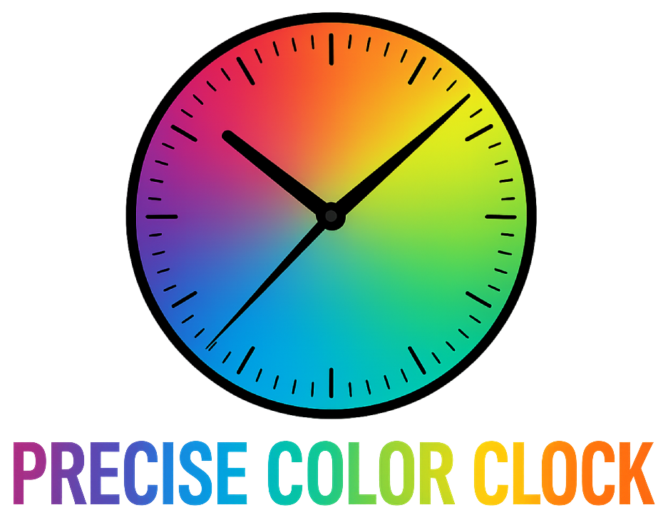
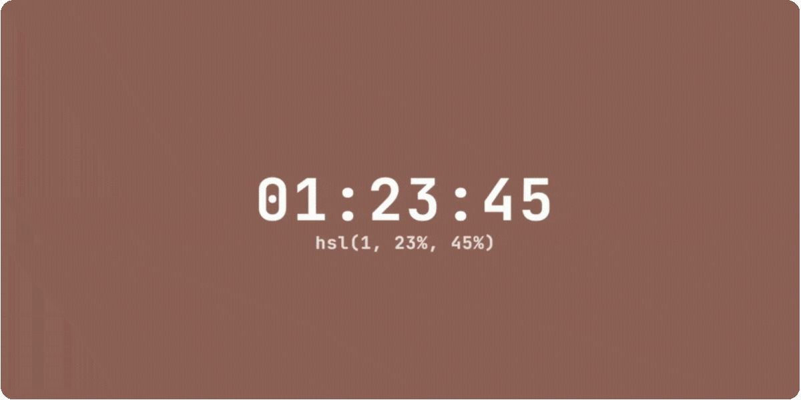

<p align="center">
  <a href="https://precise-color-clock.vercel.app">
    <picture>
      
    </picture>
  </a>
</p>

---

[**Precise Color Clock**](https://precise-color-clock.vercel.app) is an interactive web application that converts the current time into unique background colors using various color spaces, creating a mesmerizing visual representation of time itself. Discover what your current time looks like across different color spaces.

<p align="center">
  <a href="https://precise-color-clock.vercel.app">
    <picture>
      
    </picture>
  </a>
  <br/>
  <i>After all, time shouldn't just fly - it should glow ✨</i>
</p>

## 🎯 Introduction

The Precise Color Clock takes the current time (hours, minutes, seconds) and uses these values as direct parameters for CSS color functions. Each color space interprets the same time values differently, creating unique visual experiences. For example, the time `12:34:56` becomes `rgb(12, 34, 56)` in RGB mode, producing a dark blue color. This means every second of the day produces a completely unique color, creating a living palette that evolves as time passes.

## 🚀 Development

Clone the repository:

```bash
git clone https://github.com/emmanuel-ferdman/precise-color-clock.git
cd precise-color-clock
```

Install the dependencies using [Bun](https://bun.sh/):

```bash
bun install
```

Start the development server:

```bash
bun dev
```

Open the local URL shown in your terminal to view the application in your browser.

## 🤝 Contributing

Pull requests are welcome. For major changes, please open an issue first to discuss what you would like to change.

## 🙏 Credits

Precise Color Clock was inspired by [Hex Clock](https://www.jacopocolo.com/hexclock/) and enhanced to support multiple color models beyond HEX, including RGB, HSL, and HWB color spaces.

## 📄 License

The library is freely distributable under the terms of the [MIT license](LICENSE).
